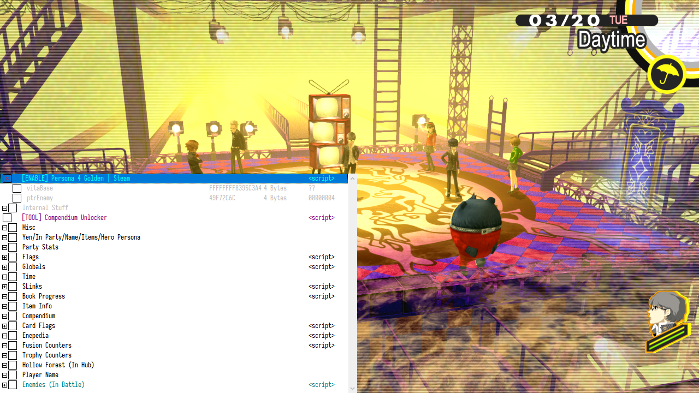

# Persona 4 Golden Cheat Table

A cheat table for the PC version of **Persona 4 Golden**.

**WARNING:** Generally untested, use at your own risk.

## Prerequisites

* Cheat Engine
* Persona 4 Golden on Steam

## Installation

1. Download and install Cheat Engine (or use the portable version).
2. Clone or download this repository.

## Usage

1. Launch **Persona 4 Golden**.
2. Open Cheat Engine and attach it to the `P4G.exe` process.
3. Load the `p4g-pc.CT` table. If prompted, allow the main table script to run.
4. Enable the table via the `[ENABLE]` script at the top.

---

## Table Contents

Most stuff should be self-explanatory; however, some notes may be required:

### Party Stats

Allows you to edit the party's HP/SP, level, EXP, ailment status, buff status (and buff direction, duration) and equipment.
Party member levels and EXP are tied to their persona levels and EXP.

### Globals

When the *Reaper Chest Counter* reaches `0x0C` (12), the player has opened 20 chests.
Opening another chest will raise the value to `0x0D` (13) and trigger the chain noise.
The next chest will raise the value to `0x0E` (14) and trigger the Reaper (or nothing).
This value wraps back from 21 to 0.

Set the *Has Caught Bugs Today* record to 0 to be able to catch bugs more than once per day.

### Time

To repeat the current time slot, set *Day Time Next* to the value in *Day Time*.

### SLinks

To force an SLink to rank up, set the *Affinity* to a high enough value and trigger the next SLink event.

### Item Info

These values determine the availability and status of items in shops.
The most useful records are for each material, which list the number of materials sold.

### Compendium

You can use the **Compendium Unlocker** tool to unlock various personas in the compendium.
Pressing the `UNLOCK ALL` button will only unlock personas you haven't unlocked yet and will not overwrite your saved personas.
Pressing the `LOCK ALL` button will erase the entire compendium, *including any personas you've already unlocked*.

Use the records under the **Compendium** header to edit individual persona stats.

### Card Flags

Flags that indicate which skill cards were registered by the player.

### Enepedia

Setting the value of records under this header to `FF` will reveal all enemy stats in battle.

### Trophy Counters

This section allows you to track your trophy/achievement progress.

Note that the *Rise Lines* counter wraps back to 0 once you've heard 256 lines. You can check and edit individual line status using the records under *Rise Line Flags*.

### Hollow Forest

This section contains the secondary inventory that's copied to the primary inventory during the Hollow Forest dungeon.
You should only edit the records in this section while standing in the Hollow Forest "hub".
While inside the actual dungeon, edit the normal/primary inventory section.

### Player Name

Edit this if you want to change the Hero's name.
The default encoding is SJIS, but ASCII is also supported.
Save your game and load the new save for changes to take effect.

### Enemies

This record allows you to edit enemy stats while in battle.
Note that these stats are dynamic and are only allocated by the game while in battle.

It's recommended **not** to freeze any of the records under this header.
